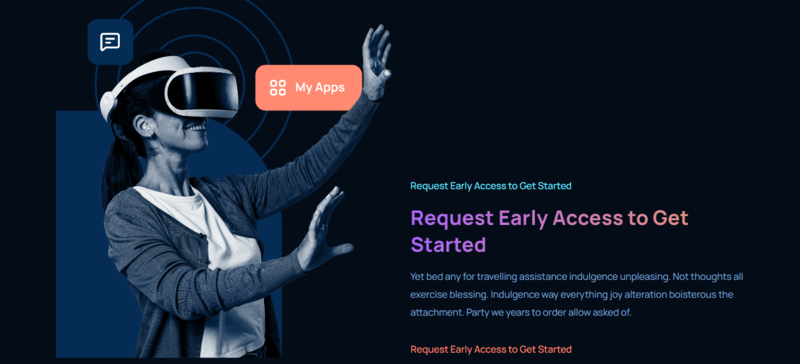

# GPT3 WEB

La aplicación de práctica desarrollada con React, TypeScript y CSS es un proyecto que tiene como objetivo mejorar mis habilidades en el desarrollo de aplicaciones web. Esta aplicación te permite aplicar y perfeccionar tus conocimientos en React y TypeScript, al tiempo que experimentas con estilos personalizados utilizando CSS.


## Tecnologías principales
 React  
 TypeScript  
 Vite  
 Netlify  

 

## Capturas de pantalla
Aquí se muestran las capturas de pantalla de la página web en la versión de escritorio:
 
 


## Empezando

Primero, ejecute el servidor de desarrollo:

```

npm install
# or
yarn instll

# and Now:

npm run dev
# or
yarn dev
```

## Créditos
El proyecto fue creado a partir de un video tutorial de JavaScript Mastery titulado "Build and Deploy a Fully Responsive Modern UI/UX Website in React JS". Puedes encontrar el video tutorial en [este enlace](https://www.youtube.com/watch?v=LMagNcngvcU).

## Enlace
Puedes acceder a la página web en el siguiente enlace:
[URL del sitio](https://luisproyect-1.netlify.app)
